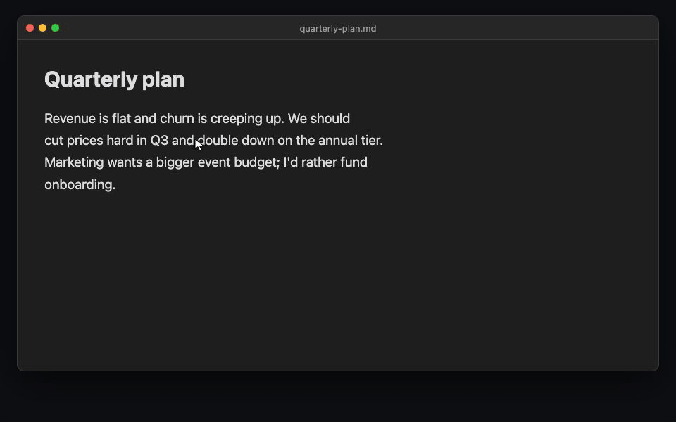

# Tandem Comments

Quote-anchored comments and edit suggestions for [Obsidian](https://obsidian.md) notes. Review threads live in a single block at the end of the file. Your prose stays untouched until you accept a suggestion, and AI assistants can read, write, and act on them with nothing but file access.



## Features

- **Comment on any selection** via command palette, hotkey, right-click menu, or the mobile toolbar
- **Suggest edits:** propose a replacement for selected text, then accept or decline it from the sidebar. Accepting is a single undoable edit
- **Markdown in comments:** bold, italics, lists, paragraphs, and links render in the sidebar. Internal `[[wikilinks]]` open the target note, Cmd/Ctrl-click or middle-click opens it in a new pane, and hovering shows Obsidian's Page Preview
- **Full thread control:** reply, edit any entry inline, delete a single reply without losing the thread, resolve, reopen, and re-anchor orphaned comments
- **Per-author colors:** stable, readable author colors in light and dark themes, with optional per-author overrides and contrast warnings
- **Automatic author name:** comments are signed with your OS account name, with a per-device override for shared vaults
- **Live highlights** in the editor (including inside tables); click a highlight to jump to its thread
- **Live re-anchoring:** comments follow your text as you edit. If an anchor's text disappears, the comment becomes *orphaned* and can be re-attached to a new selection
- **Resolve = remove** by default, keeping files clean (history mode available in settings)
- **Copy & export:** copy any thread as Markdown (with or without its quote), or export all of a file's threads to a review note in a folder of your choice
- **Invisible while you write:** the comment block is hidden in Live Preview and shows up in Reading View as a compact "💬 N threads" pill (which can be turned off)
- **AI-ready by design:** the block is plain, self-describing JSON; the settings tab exports a skill file that teaches Claude Code the format

## Installation

Tandem Comments is in the [Obsidian community plugin directory](https://obsidian.md/plugins?id=tandem-comments): in Obsidian, open **Settings → Community plugins → Browse**, search for **Tandem Comments**, then **Install** and **Enable**.

Manual install: download `main.js`, `manifest.json`, and `styles.css` from the [latest release](https://github.com/leonpawelzik/obsidian-tandem-comments/releases/latest) into `<vault>/.obsidian/plugins/tandem-comments/` and enable it in **Settings → Community plugins**.

## How it works

Comments are stored in a fenced code block at the **end of the file**. The text above it is never modified by commenting: no inline markers, no HTML spans, no IDs in your prose. Tandem Comments keeps the block at the very end, even if you type below it or add footnotes after it.

````markdown
Your note text. We should cut prices hard in Q3.

```tandem-comments
// Schema: { "<id>": { anchor:{exact,prefix,suffix,pos?}, status:open|resolved, thread:[{author,ts,text}], suggestion?:{replacement,author,ts,result?} } }
// Anchor = quote from the prose. To locate: search for "exact", disambiguate via prefix/suffix.
{
  "a1f3": {
    "anchor": { "exact": "cut prices hard", "prefix": "We should ", "suffix": " in Q3", "pos": 26 },
    "status": "open",
    "thread": [
      { "author": "Leon", "ts": "2026-06-10T10:24:00Z", "text": "Too aggressive?" }
    ]
  }
}
```
````

Each comment is anchored by a quote ([W3C TextQuoteSelector](https://www.w3.org/TR/annotation-model/#text-quote-selector)): the exact text plus a little surrounding context, with a character offset as tie-breaker.

## Usage

1. Select text in a Markdown note
2. Run **Add comment** or **Suggest edit** (command palette, right-click, or mobile toolbar)
3. Use the sidebar to discuss comments or accept and decline proposed replacements

### In the sidebar

- **Reply** in the box under each thread. Send with Cmd/Ctrl+Enter or Enter, depending on your settings
- **Edit** an entry by double-clicking it, or focus it and press Enter or F2. Save with Cmd/Ctrl+Enter, cancel with Escape. The original author and timestamp are kept
- **Resolve** with the checkmark next to the first entry of a thread
- **Copy or delete** from the ⋯ menu on each entry. Deleting a reply keeps the rest of the thread; deleting the first entry removes the whole comment
- **Jump to the passage** by clicking the quote at the top of a card
- **Show resolved** and **Export** from the sidebar header

### Commands

| Command | What it does |
|---|---|
| Add comment | Start a comment on the current selection |
| Suggest edit | Propose a replacement for the current selection |
| Open comment sidebar | Show the review threads of the active note |
| Toggle resolved threads | Show or hide resolved threads in the sidebar |
| Remove resolved threads from file | Clean up threads kept as history |
| Export review threads of active file | Write all threads to a review note |

All commands can be bound to hotkeys in **Settings → Hotkeys**.

## Edit suggestions

Suggestions use the same quote anchors and discussion threads as comments. The
original prose is not changed until you press **Accept**:

```json
{
  "7c2e": {
    "anchor": {
      "exact": "cut prices hard",
      "prefix": "We should ",
      "suffix": " in Q3.",
      "pos": 26
    },
    "status": "open",
    "suggestion": {
      "replacement": "reduce prices significantly",
      "author": "Claude",
      "ts": "2026-07-23T12:00:00Z"
    },
    "thread": [
      {
        "author": "Claude",
        "ts": "2026-07-23T12:00:00Z",
        "text": "Keeps the recommendation strong without sounding abrupt."
      }
    ]
  }
}
```

Accepting replaces only the uniquely matched quoted passage. If the passage is
missing or matches more than one location, Tandem Comments refuses to apply the
change until you re-anchor it. Other uniquely resolved open anchors are rebased
through the edit in the same transaction; ambiguous anchors are left unchanged
rather than silently bound to one duplicate. The prose edit and suggestion update
share one editor transaction, so a single Undo restores both.

## Working with AI assistants

Because comments are plain JSON inside the note, an assistant needs no plugin, API, or MCP server. Reading and writing the file is enough. Ask it to review a note and it can answer in your comment threads or propose exact replacements as suggestions. You stay in control of when the prose changes.

This shines on long-form writing, where you usually want subtle, surgical changes, not an AI rewrite of the whole piece. Comments pin your feedback to exact passages, and the assistant edits only what you pointed at:

```markdown
The morning market in Hoi An wakes before the tourists do. Vendors stack
mangosteen into careful pyramids while the river light is still gray.
…2,000 more words…
```

You leave comments where the draft needs work (*"weaker verb here?"* on one sentence, *"this paragraph drags, tighten it"* on another), then hand off:

> ❯ claude "turn my comments in hoi-an-draft.md into edit suggestions, keep the prose unchanged"

Claude proposes replacements for those two passages and explains each change in
its thread. The prose stays byte-for-byte identical until you review the
suggestions in Obsidian and accept the ones you want.

For Claude Code, open **Settings → Tandem Comments → Advanced & integrations** and use **Export skill**. This writes a ready-made skill to `~/.claude/skills/obsidian-tandem-comments/` that teaches it the format and conventions. Skill export is available in the desktop app; the comment format itself works the same on mobile.

## Settings

Settings are grouped into four sections and apply live:

- **Identity & appearance:** display name for this device, highlight color and opacity, author name colors with per-author overrides
- **Review workflow:** remove or keep resolved threads, show resolved by default, sidebar order (document position, newest or oldest activity), submit shortcut (Enter or Cmd/Ctrl+Enter), timestamp style (full, compact, relative, or hidden), confirmation before destructive actions
- **Copy & export:** include the quote when copying, export scope (all threads, or open and orphaned only), export note name (`{{filename}}`, `{{date}}`), export folder
- **Advanced & integrations:** Reading View pill, schema hints in the comment block, Claude Code skill export

## Why a block at the end of the file?

Inline comment markers break plain-text workflows: they show up in exports, confuse other tools, and make diffs noisy. Tandem Comments keeps annotations out of your prose entirely. The file remains a normal Markdown document that happens to carry its review thread with it.

## Security

Comment bodies are rendered with Obsidian's Markdown renderer and inherit its supported syntax, sanitization, and plugin post-processor behavior. Tandem Comments does not add a separate post-render HTML sanitizer.

The real sanitizer cannot run under the test harness (Node/Vitest has no Obsidian runtime). The following smoke-test matrix was verified manually with Obsidian 1.12.4:

| Comment input | Observed result |
|---|---|
| `**bold**`, `_italic_` | Renders bold / italic |
| `[link](https://example.com)` | Renders a clickable, safe link |
| Paragraph, blank line, paragraph | Two paragraphs with compact spacing |
| `<script>alert(1)</script>` | Not executed; script neutralized |
| `` | No alert; `onerror` stripped |
| `[x](javascript:alert(1))` | Click does nothing; scheme neutralized |
| `<a href="vbscript:…">`, `data:` URL | Neutralized |

## License

[MIT](LICENSE)
